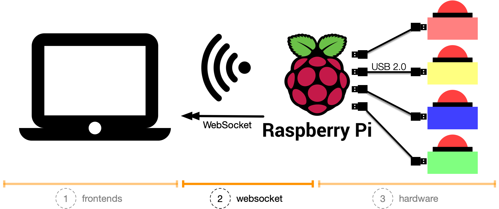

# things with buzzers: websocket

A unidirectional websocket server (and static webserver) to publish messages when someone pushed a hardware buzzer 🚀

This repository contains software to be installed on a Raspberry Pi.
Once started it listens on the hardware GPIO pins for signals and publishes them via a websocket server.

_The basic idea?_
Write your frontend and react on buzzer pushes.
Start today having fun, and make people happy by providing them an unforgettable time.

<p align="center">
  
</p>

_You are missing the context, what this is all about?_
Have a look at

* [(1) things with buzzers: Jeopardy!](https://github.com/andygrunwald/things-with-buzzers-jeopardy)
* [(3) things with buzzers: hardware](https://github.com/andygrunwald/things-with-buzzers-hardware)

## Table of Contents

- [Features](#features)
  - [Websocket server](#websocket-server)
  - [Static webserver](#static-webserver)
  - [Software buzzer emulation](#software-buzzer-emulation)
- [Test the setup (without buzzer)](#test-the-setup-without-buzzer)
- [Usage and configuration](#usage-and-configuration)
- [Development](#development)
  - [Native build](#native-build)
  - [Native build for Raspberry Pi](#native-build-for-raspberry-pi)
  - [Running the tests](#running-the-tests)
  - [Creating a new release](#creating-a-new-release)
  - [Deploy it to the Raspberry Pi](#deploy-it-to-the-raspberry-pi)
  - [Raspberry GPIOs](#raspberry-gpios)
- [Contribute](#contribute)

## Features

### Websocket server

The websocket server is available on the configured HTTP interface + port (default `*:8080`) and via the `/stream` route: `ws://localhost:8080/stream`.

This socket connection is unidirectional.
It is a one-way communication. From the Raspberry Pi to the connected frontend/client.
Pushing messages back to the Raspberry Pi is not supported (yet).

Have a look at [a minimal JavaScript implementation](./static/dummy.html) on how to connect to this socket.

### Static webserver

The static web server is available on the configured HTTP interface + port (default `*:8080`) and via the `/static` route: `http://localhost:8080/static/*`.

Every file placed in the `/static/` folder is available via this server.
A [dummy.html](./static/dummy.html) file is placed there for testing purposes.

HTTPS is not supported (yet).

The use case of this static webserver:
Write your static frontends (e.g., only with HTML, CSS, and JavaScript), place them in the `/static/` folder and have your buzzer-action going!

### Software buzzer emulation

Sometimes you don't have hardware buzzers available.
Either, because you still plan to build them or they are simply at another location and not next to you.
But this should not limit us, to build new frontends or experiment with the stack.
For this reason and purpose, we have implemented a software buzzer emulation.

The software buzzer emulation is available on the configured TCP interface + port (default `*:8181`) and via TCP clients (e.g., telnet):

```sh
$ telnet localhost 8181
```

Once connected, the server supports the following commands:

| Command   | Description                                                            |
| --------- | ---------------------------------------------------------------------- |
| `/red`    | Sends a websocket message "Color: red" / Emulates the red buzzer       |
| `/green`  | Sends a websocket message "Color: green" / Emulates the green buzzer   |
| `/blue`   | Sends a websocket message "Color: blue" / Emulates the blue buzzer     |
| `/yellow` | Sends a websocket message "Color: yellow" / Emulates the yellow buzzer |
| `/quit`   | Quits the connection                                                   |

Happy emulating!

## Test the setup (without buzzer)

Let us connect the dots and test the full setup without hardware buzzers and with our software emulation:

1. Download the `twb-websocket` binary and start it: `./twb-websocket`
2. Open a browser and go to http://localhost:8080/static/dummy.html
3. Open a terminal and connect to the TCP socket: `telnet localhost 8181`
4. Type `/yellow` into the terminal
5. You should see a message `{"Color":"yellow"}` in your browser window.

Your test was successful. You are good to go!

## Usage and configuration

The help output can be requested with:

```sh
$ ./twb-websocket -help
Usage of ./twb-websocket:
  -hardware-buzzer
    	Enforces initialization of hardware buzzer (even on non arm architectures)
  -http-listen-addr string
    	HTTP server listen address (default ":8080")
  -tcp-listen-addr string
    	TCP/Software buzzer server listen address (default ":8181")
```

All settings are configurable via commandline flags or environment variables.

| Commandline flag    | Environment variable   | Default value | Description                                                                |
| ------------------- | ---------------------- | ------------- | -------------------------------------------------------------------------- |
| `-hardware-buzzer`  | `TWB_HARDWARE_BUZZER`  | `false`       | Enforces initialization of hardware buzzer (even on non arm architectures) |
| `-http-listen-addr` | `TWB_HTTP_LISTEN_ADDR` | `:8080`       | HTTP server listen address (default ":8080")                               |
| `-tcp-listen-addr`  | `TWB_TCP_LISTEN_ADDR`  | `:8181`       | TCP/Software buzzer server listen address (default ":8181")                |

The application starts with sane defaults:

* Websocket and Webserver available via port `*:8080` on all interfaces (via HTTP)
* Software buzzer emulation enabled and available via port `*:8181` on all interfaces (via TCP/telnet)

## Development

### Native build

```sh
$ go build -o twb-websocket
```

### Native build for Raspberry Pi

```sh
$ GOARM=7 GOARCH=arm GOOS=linux go build -o twb-websocket
```

### Running the tests

```sh
$ go test -v
```

### Creating a new release

For our release process, we use [goreleaser.com](https://goreleaser.com/) and [semantic version](http://semver.org/):

```sh
# Create a new git tag
$ git tag -a v0.1.0 -m "First release"
$ git push origin v0.1.0

# Ship the release
$ goreleaser
```

### Deploy it to the Raspberry Pi

We assume that your Pi has the IP address _192.168.178.41_.
It will deploy the _twb-websocket_ binary into the _/home/pi_ folder on your Pi.

```sh
$ scp twb-websocket pi@192.168.178.41:
```

### Raspberry GPIOs

This server listens on the following [GPIO pins](https://www.raspberrypi.org/documentation/usage/gpio/):

| GPIO Pin (BCM) | Purpose       | GPIO Pin (Physical) |
| -------------- | ------------- | ------------------- |
| 21             | Red buzzer    | 40                  |
| 20             | Green buzzer  | 38                  |
| 16             | Blue buzzer   | 36                  |
| 12             | Yellow buzzer | 32                  |

The [pin-out mapping from the go-rpio documentation](https://godoc.org/github.com/stianeikeland/go-rpio) is super helpful.

## Contribute

If you want to create and ship awesome things: *Go ahead and make this better*.
Feel free to fork it and play your changes back via a [Pull Request](https://help.github.com/en/articles/about-pull-requests).

If you ...
* are unsure
* plan to do a more significant rework
* want to get feedback about the idea before you put the effort in
[Open an issue](https://github.com/andygrunwald/things-with-buzzers-websocket/issues/new) and let us talk about your idea.

You have [built your own buzzers](https://github.com/andygrunwald/things-with-buzzers-hardware) and did awesome things with it?
Write an article in your blog, or tell us the story in an issue or make a Pull Request with a Markdown file.
But tell us. Let us know. Inspire us!

We believe that we can do more together. Let's to it together! 🚀